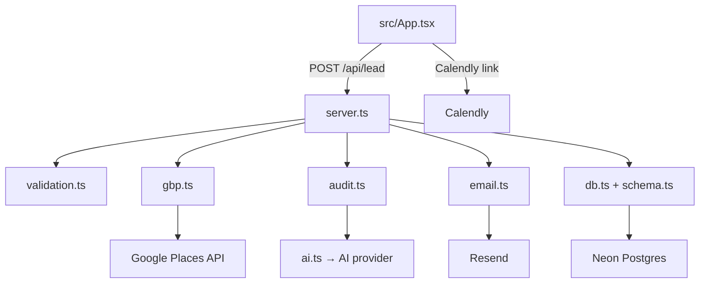

# Architecture

## Overview

stoneVEIL is a lead-generation web app for 2–3 person local construction
contractors. Core loop: a visitor submits the "missed-call audit" form → the
server validates and sanitizes the input, fetches the business's Google Business
Profile (GBP) data, runs an AI audit that scores fit and drafts
recommendations, stores the lead in Neon Postgres, and emails a tailored
summary. Hot-tier leads receive a prefilled Calendly link.

Stack: React (Vite) frontend · Node/Express backend · Drizzle + Neon Postgres ·
pluggable AI provider · Google Places API · Resend email.

## Functional areas

### Frontend — `src/`

| File | Role |
|------|------|
| `src/App.tsx` | Single-page React app: hero, sections, ROI calculator, lead form, audit results |
| `src/main.tsx` | Vite entry point |
| `src/index.css` | Tailwind v4 theme + "lift the veil" design tokens |
| `src/types.ts` | Shared types between the form and the API response |

### Backend — `server.ts`

Express server. Public route `POST /api/lead` runs the capture → GBP → audit →
store → email pipeline. Admin routes (`/admin/dashboard`, `/admin/demo`) are
gated by HTTP Basic auth (`ADMIN_PASSWORD`) and disabled when it is unset.

### Core libraries — `lib/`

| Module | Responsibility |
|--------|----------------|
| `lib/ai.ts` | AI provider config — model id + key resolution. The only vendor-specific file. |
| `lib/audit.ts` | Audit + fit scoring: builds the prompt, parses JSON, derives tier server-side. |
| `lib/demo.ts` | Demo-page generator used by the admin tool. |
| `lib/gbp.ts` | Google Places client — business details, photos, reviews. |
| `lib/email.ts` | Resend audit email construction + delivery. |
| `lib/validation.ts` | Input sanitization (`sanitizeString`, `clampInt`, `validateLeadInput`). |
| `lib/schema.ts` | Drizzle schema — `leads` table. |
| `lib/db.ts` | Neon Postgres connection. |

## Key execution flow — lead capture

```
POST /api/lead (server.ts)
  ├─ validateLeadInput            (lib/validation.ts)  — sanitize + bound input
  ├─ fetchGbpData                 (lib/gbp.ts)         — GBP lookup (degrades to null)
  ├─ runAudit                     (lib/audit.ts)       — AI scoring + recommendations
  │    └─ getAiClient / AI_MODEL  (lib/ai.ts)
  ├─ db.insert(leads)             (lib/db.ts)          — persist to Neon
  └─ sendAuditEmail               (lib/email.ts)       — fire-and-forget Resend
```

## Architecture diagram



## Security boundaries

All user input passes through `lib/validation.ts` before reaching the database
or the model. Form fields and GBP data are treated as untrusted and wrapped in
delimiter blocks in the prompt; the audit tier is always derived server-side
from the numeric score, never taken from model output. Demo-page and email HTML
are escaped. Admin routes require Basic auth. Production sets a strict CSP and
HSTS in `server.ts`.
