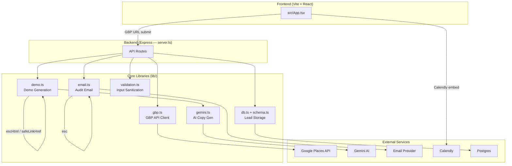

# Architecture

## Overview

Stoneveil is a lead-generation web app targeting 2–3 person local contractors. The core loop: a visitor enters their Google Business Profile URL → the app fetches their GBP data, uses Gemini to generate a personalized demo site mockup, gates the result behind a Calendly booking, and emails them an audit report. Leads are stored in a Postgres database via Drizzle ORM.

- **35 source files · 328 symbols · 6 execution flows**
- Stack: React (Vite) frontend · Node/Express backend · Drizzle + Postgres · Gemini AI · Google Places API

---

## Functional Areas

### Frontend — `src/`

| File | Role |
|------|------|
| `src/App.tsx` | Single-page React app; handles GBP URL input, demo display, Calendly gating |
| `src/main.tsx` | Vite entry point |
| `src/types.ts` | Shared TypeScript types between frontend and server |

### Backend — `server.ts`

Express server exposing the API. Orchestrates GBP fetch → Gemini generation → lead storage → email dispatch. All business logic delegates to `lib/`.

### Core Libraries — `lib/`

| Module | Responsibility |
|--------|---------------|
| `lib/demo.ts` | Demo page generation pipeline — GBP data → Gemini copy → safe HTML output |
| `lib/email.ts` | Audit email construction and delivery (SendGrid or similar) |
| `lib/gbp.ts` | Google Business Profile API client — fetch business details, photos, reviews |
| `lib/gemini.ts` | Gemini AI client — prompt construction, copy generation, retargeting |
| `lib/validation.ts` | Input sanitization (`sanitizeString`, `clampInt`, `validateLeadInput`) |
| `lib/schema.ts` | Drizzle ORM schema — leads table |
| `lib/db.ts` | Database connection and query helpers |

### Scripts — `scripts/`

Standalone runnable scripts for development and spike work: GBP API exploration (`gbp-spike.ts`), demo generation smoke tests (`generate-demo.ts`), lead seeding (`seed-test-leads.ts`), transport testing (`transports-spike.ts`).

### Scratch — `scratch/`

Dev-only utilities: DB inspection (`check-db.ts`), teardown (`drop-all.ts`, `drop-leads.ts`), security validation smoke tests (`test-security.ts`).

---

## Key Execution Flows

### 1. Demo Page Generation
Triggered when a lead submits their GBP URL. The longest and most central flow.

```
generateDemoPage (lib/demo.ts)
  └─ generateCopy (lib/demo.ts)          ← calls Gemini with GBP data
       └─ buildGbpPromptSection           ← formats GBP fields into prompt
  └─ buildDemoHtml (lib/demo.ts)         ← assembles final HTML
       ├─ safeLinkHref                    ← validates outbound URLs
       └─ escHtml                         ← XSS-safe HTML escaping
```

### 2. Audit Email Dispatch
Sends the GBP gap-analysis email after a lead books or requests it.

```
sendAuditEmail (lib/email.ts)
  └─ buildEmailHtml (lib/email.ts)
       └─ buildGbpGapsSection             ← identifies missing/weak GBP fields
            └─ esc                        ← escapes content for HTML email body
```

### 3. Input Validation
Applied at every API boundary before data touches the DB or AI layer.

```
validateLeadInput (lib/validation.ts)
  ├─ sanitizeString                       ← strips dangerous characters
  └─ clampInt                             ← bounds-checks numeric fields
```

---

## Architecture Diagram



---

## Data Flow Summary

```
Visitor
  → enters GBP URL
  → [validation] sanitizeString, clampInt
  → [gbp] fetch business details from Google Places
  → [gemini] generate retargeted copy
  → [demo] assemble safe HTML mockup
  → shown demo (gated by Calendly booking)
  → [db] lead saved to Postgres
  → [email] audit report dispatched
```

---

## Security Boundaries

All user input passes through `lib/validation.ts` before reaching any downstream system. HTML output (both demo pages and email bodies) is escaped via `escHtml`/`esc` to prevent XSS. Outbound links are validated through `safeLinkHref`. See `scratch/test-security.ts` for validation smoke tests.
